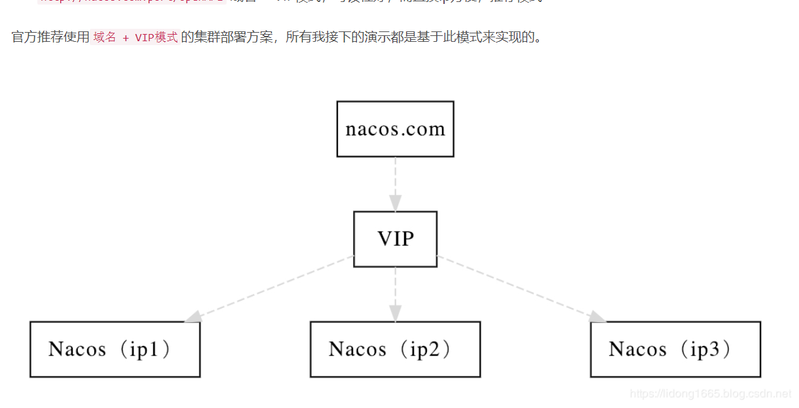

## nacos集群配置方式      
支持AP和CP模式,根据服务注册选择临时和永久来决定走AP模式还是CP模式。   
nacos leader不可用的情况
   1. 不影响服务之间互相调用
   2. 不影响服务注册
   3. 不影响服务正常启动拉取配置文件
   4. 选举新leader差不多4,5秒钟

nacos集群推荐部署方案，官方建议至少3个或3个以上的节点来实现集群模式

最先启动的节点， 一般就是 leader ， 但这个时候还只是 准leader，需要至少多数节点都启动了， 才能做一个决断。

## 修改所有nacos节点conf目录下cluster.conf文件，将ip:prot添加进去，配置文件内容如下   
    10.200.10.159:8847      
    10.200.10.159:8848      
    10.200.10.159:8849     
    
    其他实例修改Nacos端口
    修改nacos的conf目录下application.properties下的server.port，三个实例分别为：8851、8849、8850    
    

    
## 集群模式必须使用MySQL数据库，生产使用建议至少主备模式，或者采用高可用数据库**

配置文件在nacos的conf目录下的application.properties，添加以下配置   
~~~ db.num=1
db.url.0=jdbc:mysql://127.0.0.1:3306/nacos_config?characterEncoding=utf8&connectTimeout=1000&socketTimeout=3000&autoReconnect=true
db.user=root
db.password=123456
~~~

db.num 为数据库实例数量   
db.url.0 指定不同的数据库连接

## 修改conf/nginx.conf配置

~~~
upstream nacos {
    server 192.168.28.130:8851;
    server 192.168.28.130:8849;
    server 192.168.28.130:8850;
}

server {
    listen 80;

    server_name nacos.a-hh.cn;

    location / {
        proxy_pass http://nacos;
    }
}
~~~